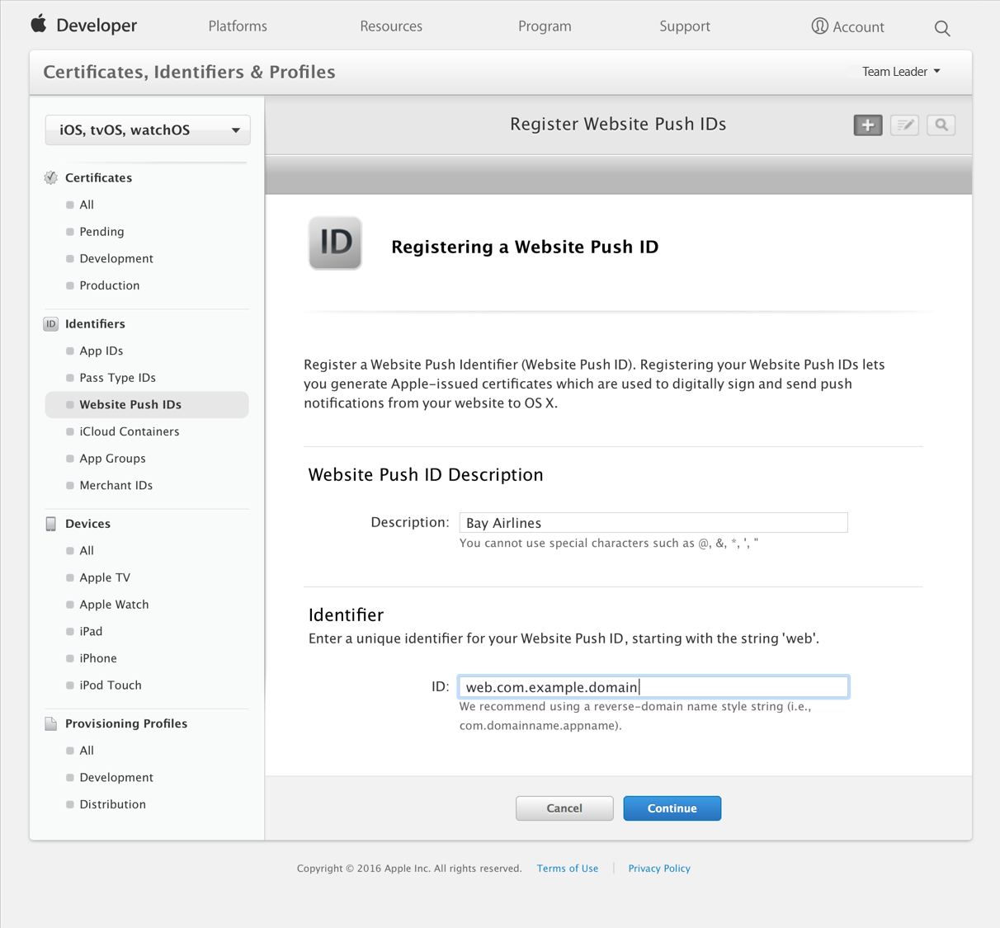

# Configuring Apple Push Notifications Service (APNS)

### Registering with Apple
You must register in the [Certificates, Identifiers & Profiles](https://developer.apple.com/account/ios/certificate) section of your developer account to send push notifications. Registration requires an [Apple developer license](https://developer.apple.com/programs).

When registering, add the following information:

##### Identifier
This is your unique reverse-domain string, such as web.com.example.domain (the string must start with web.). This is also known as the **Website Push ID**.
Use this value for `pushId` in config file.

##### Website Push ID Description
This is the name used throughout the Provisioning Portal to refer to your website. Use it for your own benefit to label your Website Push IDs into a more human-readable format.

The registration process looks like the form in Figure given below-



### Obtaining Authentication Token
To obtain an APN Authentication Token, follow the steps given [here](http://help.apple.com/xcode/mac/current/#/dev54d690a66). 
After obtaining this token in the form of a `.p8` file, place the file in the root directory of the project, and specify its name in `authenticationToken` in config file.
The Key ID obtained after generating the token should be added in `keyId` in config file.

### Creating the Push Package

1. First we need to create a `.p12` file which will be later used to sign the push package. To create this file, follow the following steps on macOS-
    - Log in into [Developer Overview](https://developer.apple.com/account/overview.action). Under there you should see a folder link titled `Certificates`. Navigate there and you go into a same view where we’ve created Push ID. This time we select `Certificates` and create a new certificate.

    - Now you should see a list of Development and Production certificate types. Under `Production` there is a checkbox for `Website Push ID Certificate`. After selecting that you’ll get a prompt about which Website Push ID we are going to use. This should be obvious.

    - Now we’re going to create a CSR by using `Keychain Access`. Launch it and select `Keychain Access » Certificate Assistant » Request a Certificate from Certificate Authority`.

    - Fill in your details (leave empty if unsure). Request is `Saved to disk`. Now you should be able to save `[filename].certSigningRequest` file to the Desktop.

    - Now that we’re done with the CSR file we can continue our process on Development Portal and generate our certificate. After that we’re able to download our `.cer` file. After downloading it, double-click the .cer file.

    - You should end up in the Keychain Access, under `login` section, where you should see your certificate. Right-click it and select `“Export Website Push ID [web.your.reversed.domain.name]”`. This should open up a dialog where you can save [filename].p12. Then you’ll be prompted with the password which will be used to protect the exported item. In our case this can be left empty.

    Now that we’ve created `.p12` file, we can proceed on creating the actual package.
    
2. Create a directory with the following structure-
    ```
    pushpackage
        createPushPackage.php
        web-push-ID.p12
        pushPackage.raw
            website.json
            icon.iconset
                icon_128x128@2x.png  
                icon_128x128.png  
                icon_32x32@2x.png  
                icon_32x32.png  
                icon_16x16@2x.png  
                icon_16x16.png
    ```
    
    **Description of contents of `pushpackage`**

    - **createPushPackage.php**
    Download the file from [this link](createPushPackage.php) and save it inside `pushpackage`
    - **web-push-ID.p12**
    `.p12` certificate obtained in the previous step
    - **icon.iconset**
    This directory contains the badge icon to be used in the notification in various sizes for normal and retina displays.
    - **website.json**
        ```
        {
            "websiteName": "ALICE ControlGUI",
            "websitePushID": "web.ch.cern.anirudh",
            "allowedDomains": ["https://pcald31.cern.ch"],
            "urlFormatString": "https://pcald31.cern.ch",
            "authenticationToken": "19f8d7a6e9fb8a7f6d9330dabf",
            "webServiceURL": "https://pcald31.cern.ch"
        }
        ```
    
    The description of various fields in this file are:

    - `websiteName` – The website name. This is the heading used in Notification Center.
    - `websitePushID` – The Website Push ID, as specified in your registration with the Member Center.
    - `allowedDomains` – An array of websites that are allowed to request permission from the user.
    - `urlFormatString` – The URL to go to when the notification is clicked. Use %@ as a placeholder for arguments you fill in when delivering your notification. This URL must use the http or https scheme; otherwise, it is invalid.
    - `authenticationToken` – A string that helps you identify the user. It is included in later requests to your web service. This string must 16 characters or greater.
    - `webServiceURL` – The location used to make requests to your web service. The trailing slash should be omitted.

3. Open the terminal, navigate inside the `pushpackage` directory and run the command-
      ```bash
      php createPushPackage.php > pushpackage.zip
      ```

4. A new zip file `pushpackage.zip` is generated inside the `pushpackage` directory. Copy this file into the `root directory` of your project.